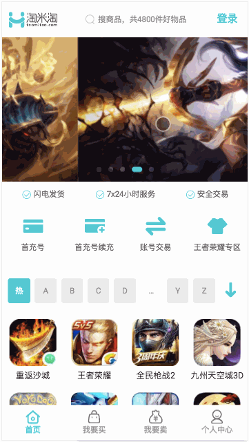
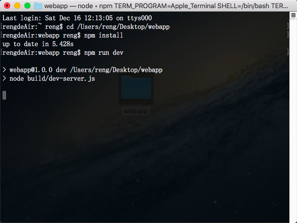
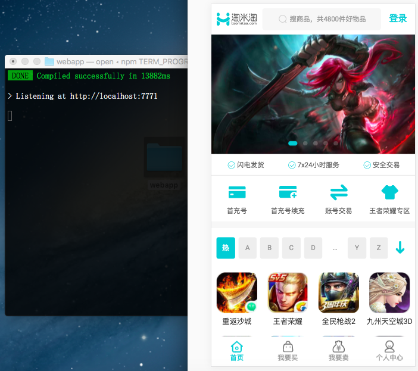
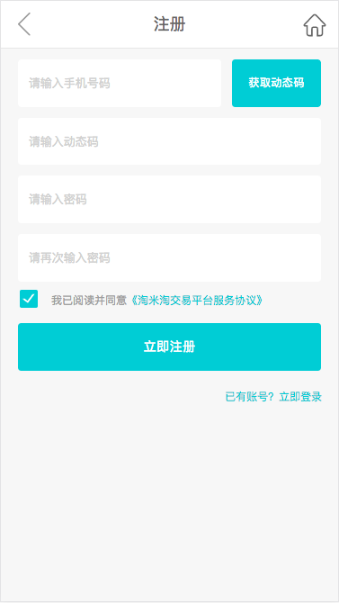
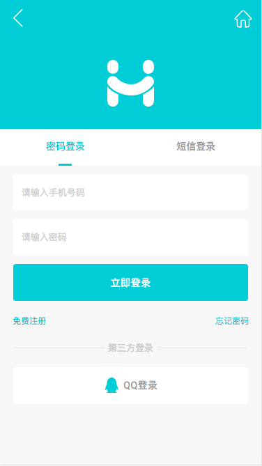
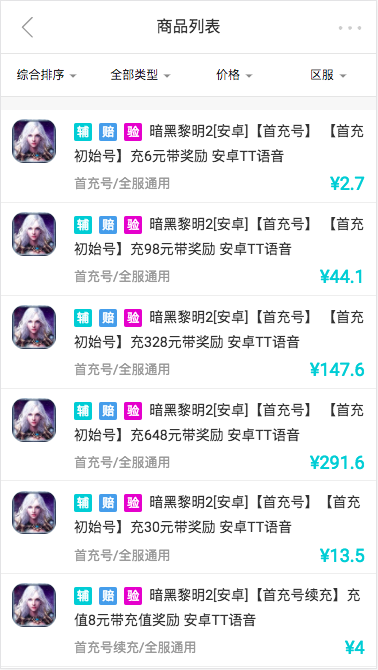
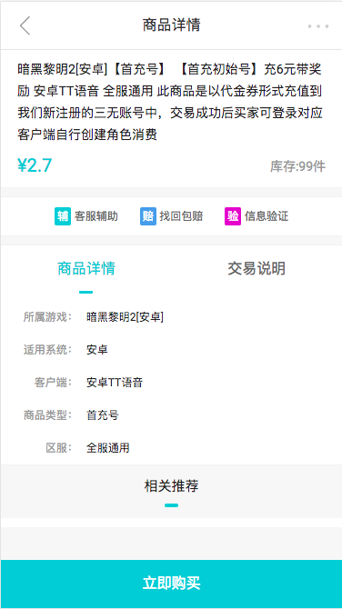
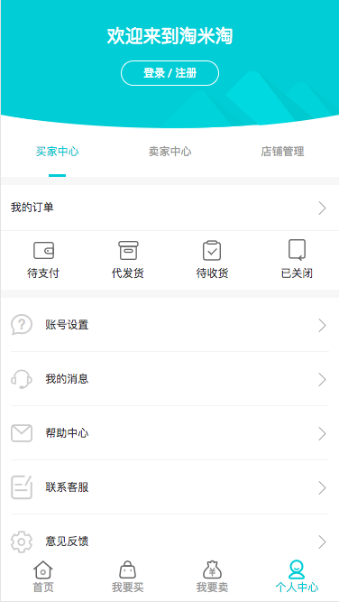

# webapp

如果你喜欢本仓库，那就点个星星了 :blush:

:warning: 本仓库代码仅仅供学习使用哦

## 运行的gif效果



## 怎么使用

```bash

  # download the zip
  $ git clone https://github.com/reng99/webapp.git

  # enter the root catalogue
  $ cd webapp

  # install dependencies
  $ npm install

  # dev mode
  $ npm run dev
  # automally show in browser whick address is localhost:8000

  # dev mode
  $ npm run build

```

你可以参考下面的图片运行（dev 环境）






## 一些主要页面的截图,详情请运行本仓库查看













